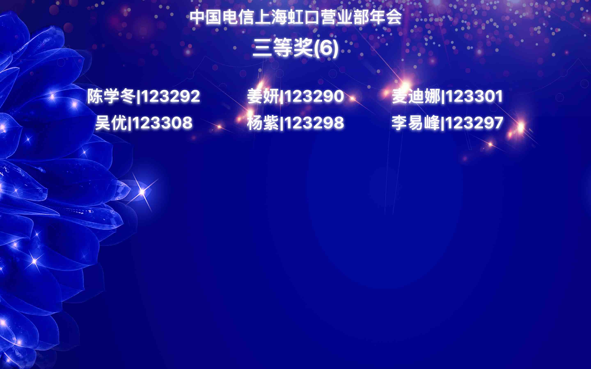

# 不用区块链，抽奖永远不会公平

这一年，抽奖火爆了整个互联网 
大大小小的商家企业都开始进行抽奖活动，伴随着抽奖活动而来的，是汹涌的质疑。
1. 10月7日上午，支付宝公布年度锦鲤获奖者“信小呆”，女性，年龄不大不小，容貌不美不丑，域名xinxiaodai.com一年前已由Alibaba Cloud Computing (Beijing) Co., Ltd.注册。
2. 11月11日，王校长宣布1万元现金抽奖的获奖名单，结果113个人中有112个是女生。
各大团体、年会活动的抽奖环节，坚守了10年中奖绝缘体的角色 
是巧合吗？宝宝心里哭了无数遍，为什么中奖的永远都是她不是我 
这里面肯定有阴谋。有阴谋。有阴谋。。。

# 当抽奖遇到区块链？信任利器
区块链作为继互联网之后的一项革命性的创新技术，具有去中心化、信息不可纂改、可信任、可追溯、透明化等特性，天然适合抽奖领域：
- 区块链系统按照约定好规则（智能合约）自动进行抽奖，区块链不认识马云，不认识王校长，不会被收买，抽奖结果的产生过程无法作弊。
- 区块链所有产生的有效信息与数据不可抵赖，不可篡改，意味着抽奖结果的传播过程无法作弊，用户可以通过合约地址与交易哈希进行查询。
- 区块链智能合约（随机抽奖算法）完全透明开放，无法隐藏后门，大家可以监督与提出修改意见。
- 区块链交易公开透明，利用区块链技术的可溯源性，可对结果进行验证。一旦有人试图攻击、篡改抽奖系统，都会被人发现。

# 基于区块链的活动抽奖实践LUCKYDOG
LUCKYDOG是基于区块链EOS公链开发的一款可定制化的活动抽奖系统，具有：
- 抽奖更公开：由智能合约（随机抽奖算法）抽奖，杜绝黑幕，用户可对算法代码进行审查，并提出修改意见和建议
- 抽奖更透明：抽奖过程与结果在区块链上可追溯，用户可以通过合约地址与交易哈希进行查询
- 抽奖更公平：抽奖算法概率分布均匀，保持公平公正
- 抽奖更灵活：抽奖内容支持自定义配置，支持配置从创建到参与到开奖的全流程

## 年会版操作tips:
- 活动负责人发起活动：[http://luckydog.jujinpan.com](http://luckydog.jujinpan.com)，提交活动／准入名单以及抽奖轮次信息，获得活动二维码
- 抽奖大屏幕投影，更可自定义高颜值背景与公司LOGO
- 员工手机扫描二维码签到，更有弹幕增添乐趣
- 简明易懂的各种抽奖操作

---

诚邀各位朋友体验"LUCKYDOG" 
年会抽奖系统仅采取邀请码注册的方式。对区块链感兴趣，想要体验基于区块链公平公正抽奖的个人/团体以及公司，可以扫描下方的二维码联系管理员获取注册邀请码。 
欢迎有抽奖需求的伙伴联系探讨合作 

## 部分系统效果图

