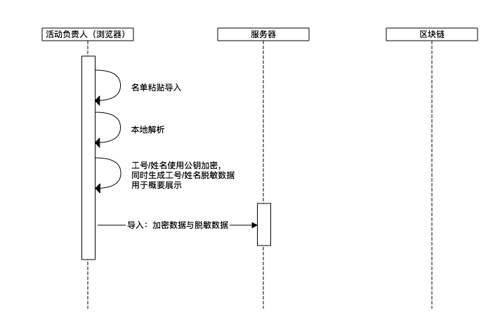
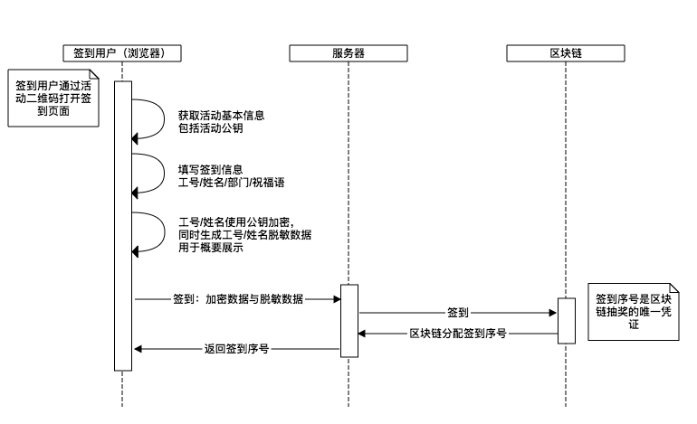
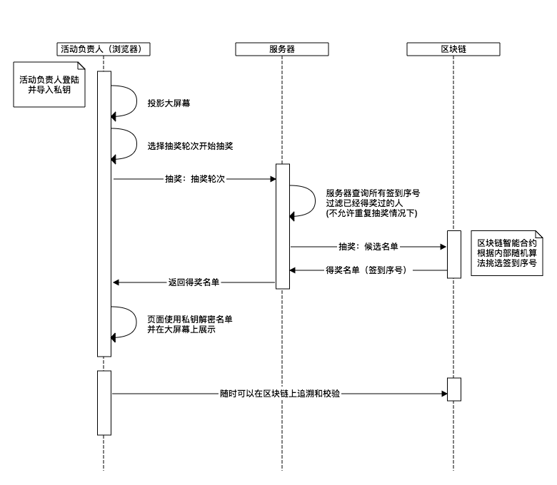
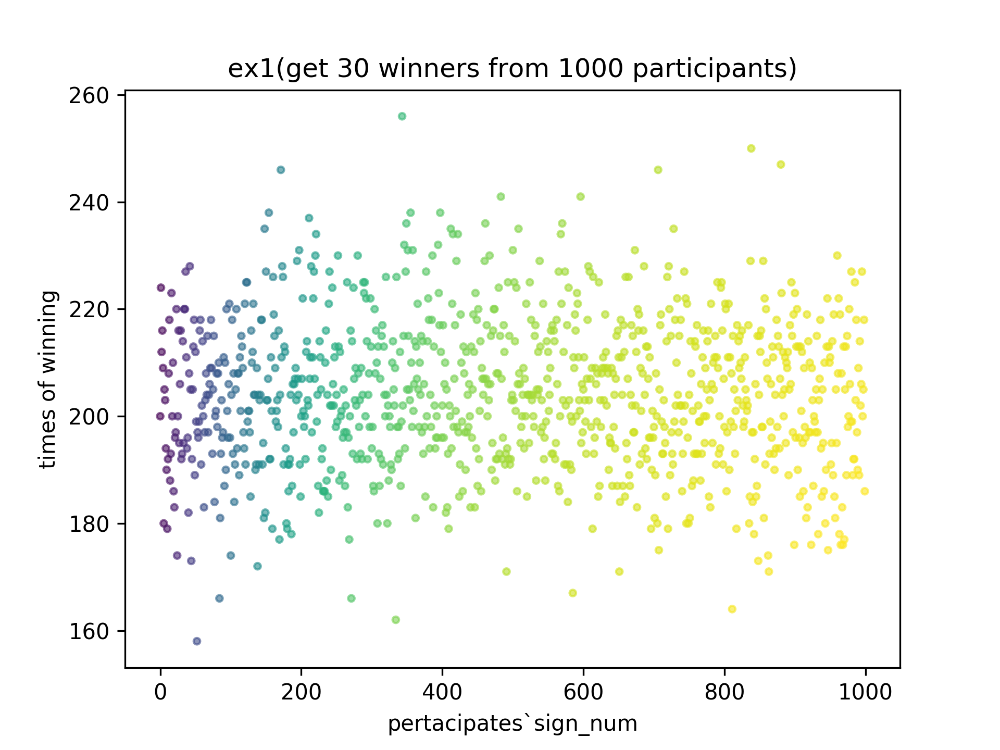
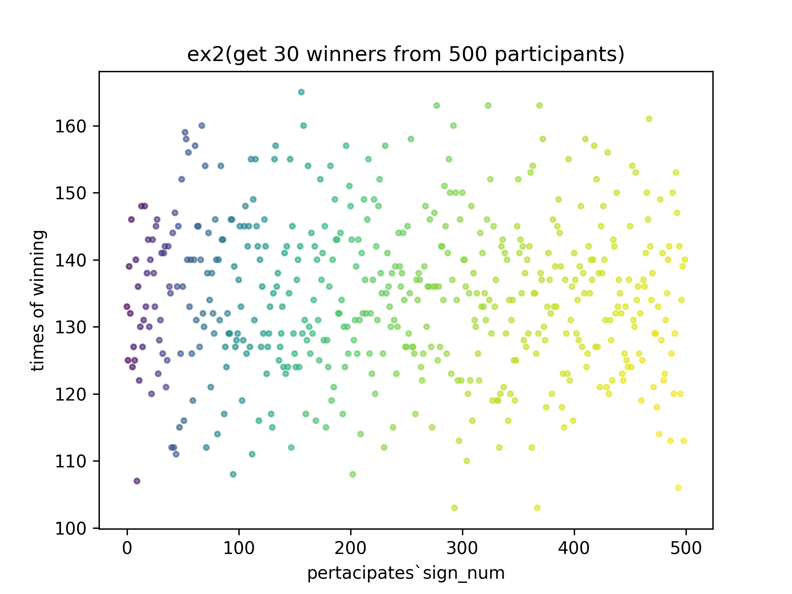
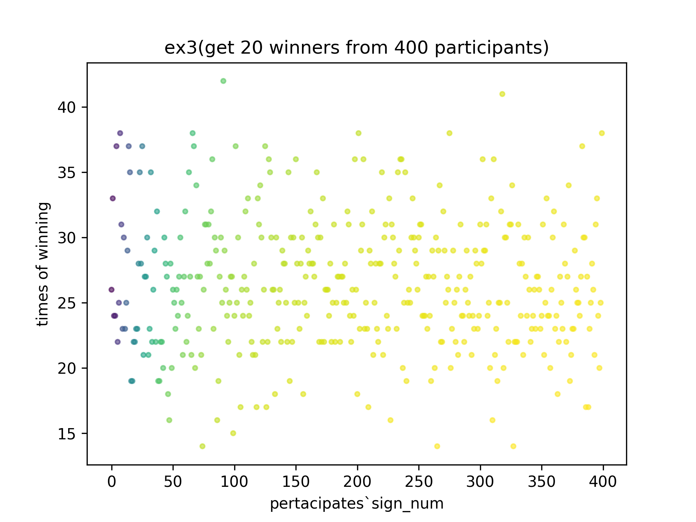
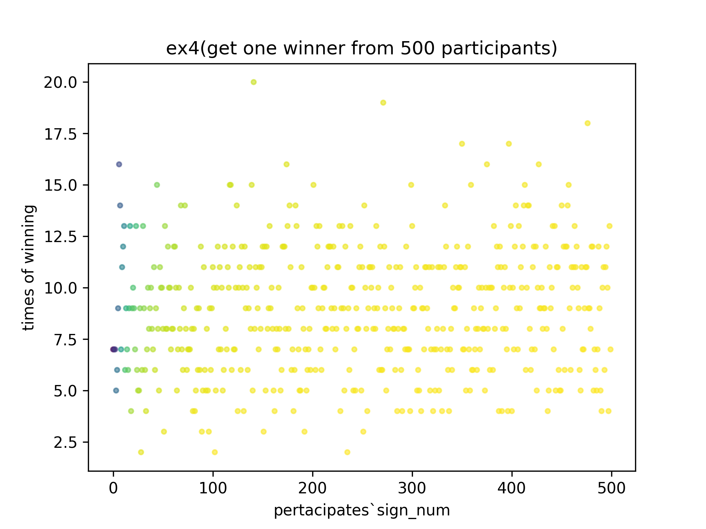

# 基于区块链的活动抽奖实践

## 数据安全

### 抽奖名单防侵入
活动二维码任何人都可以扫描，系统通过设置允许名单限制签到范围，只有签到信息与允许名单匹配才能签到成功，防止无效名单侵入。

### 允许名单防泄漏
启用数据加密后，允许名单(姓名与工号)都将用活动设置的公钥加密之后才上传到区块链，同时生成其脱敏之后的概要信息用于友好展示。

### 签到信息防泄漏
启用数据加密后，签到信息(姓名与工号)都将用活动设置的公钥加密之后才上传到区块链，同时生成其脱敏之后的概要信息用于友好展示，所有人都可以查看当前签到人列表（参与抽奖者）。

## 随机抽奖
区块链智能合约从员工签到序号中(签到时由区块链智能合约分配)公平公开的随机挑选并返回，所有抽奖过程都可以在区块链上追溯和校验，杜绝人工干预／作假的可能

## 区块链智能合约随机算法公平性论证
随机算法概率分布 
该随机算法基本能每个人被抽中的机会大致相等，抽中概率相差较小 
随机算法测试数据和结果在doc/statistics/文件夹下（包括实验样本，实验结果统计图和实验结果统计数据文档) 
1. 实验1为从1000人中抽取30人的实验，结果如图 

2. 实验2为从500人中抽取20人的实验，结果如图 

3. 实验3为从400人中抽取20人的实验，结果如图 

4. 实验4为从500人中抽取1个人的实验，结果如图 

